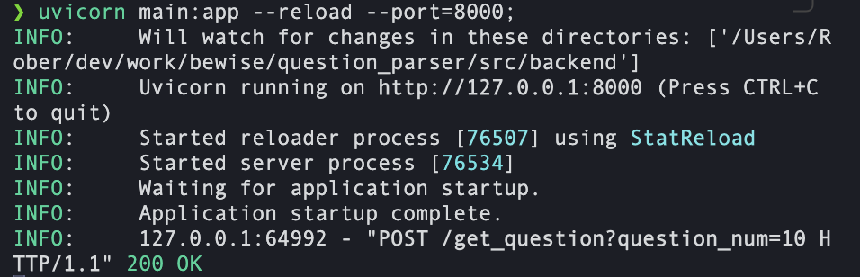
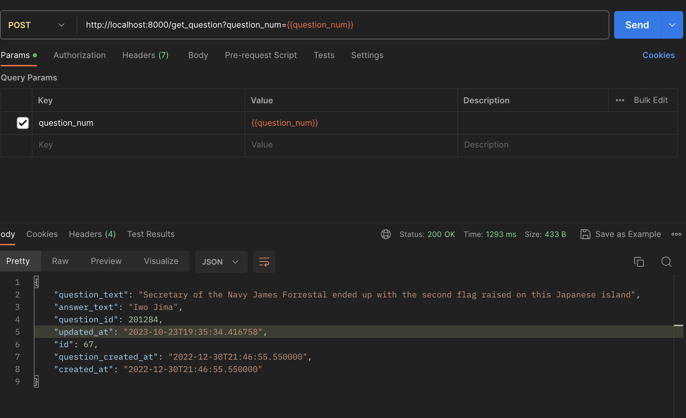
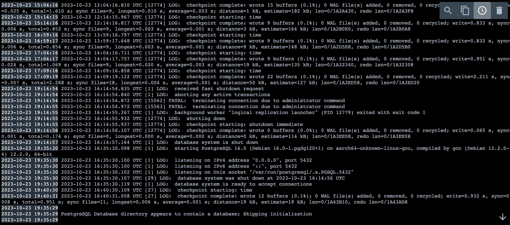

# Установка
Для того, чтобы запустить проект необходимо: 
1. клонировать проект
2. развернуть postgresql
```bash
docker compose -f src/docker-compose.yaml up 
```
3. установить все необходимые зависимости, запустить сервис
```bash
cd src
chmod +x setup_script.sh run_script.sh
./setup_script.sh
```
---

# Использование
Чтобы воспользоваться сервисом, необходимо выполнить POST-запрос по данному url-адресу [http://localhost:8000/get_question?question_num={{question_num}}](http://localhost:8000/get_question?question_num={{question_num}})
* question_num: int - число обращений к стороннему сервису, хранящий в себе базу вопросов для викторины 

Ответом на данный запрос будет json, содержащий в себе предыдущий сохраненный вопрос для викторины, как и требовалось по условиям задачи, в формате: 
```json
{
  "question_text": String,
  "answer_text": String,
  "question_id": Integer,
  "updated_at": DateTime,
  "id": Integer,
  "question_created_at": DateTime,
  "created_at": DateTime
}
```
* question_text - текст вопроса
* answer_text - ответ на вопрос
* question_id - идентификатор вопроса на стороннем сервисе
* updated_at - время изменения записи
* created_at - время создания записи
* question_created_at - время создания вопроса на стороннем сервисе
* id - идентификатор записи

# Работа
## Работоспособность сервиса
 
Логи работы сервиса. Подобное можно будет лицезреть при запуске `run_script.sh`


Результат работы сервиса по запросу 
```http
POST /get_question?question_num=10 HTTP/1.1
Host: localhost:8000
```

### Контейнеры
Параметры подключения к бд:

**host**: localhost
**port**: 42069
**db**: bewise_get_questions
**user**: postgres
**password**: postgres


Логи работы контейнера постгреса будут примерно такими

---
### Примерное содержимое таблицы *questions* 
|id|question_text|answer_text|question_created_at|question_id|created_at|updated_at|
|--|-------------|-----------|-------------------|-----------|----------|----------|
|34|This Civil War general wrote "Ben-Hur"|Lew Wallace|2022-12-30 18:38:07.010|1199|2022-12-30 18:38:07.010|2023-10-23 17:03:46.925|
|64|"Every murderer is probably somebody's old friend" she wrote in her 1st Hercule Poirot novel|Agatha Christie|2022-12-30 18:39:36.372|4937|2022-12-30 18:39:36.372|2023-10-23 19:35:34.416|
|53|This best-selling brand of cookies is also available as "cookies n' cream" ice cream|Oreos|2022-12-30 18:40:13.610|6494|2022-12-30 18:40:13.610|2023-10-23 17:05:03.681|
|46|It's the longest river entirely within England|the Thames|2022-12-30 18:40:27.989|7102|2022-12-30 18:40:27.989|2023-10-23 17:04:38.742|
|13|Like monkeys & squirrels, the coconut crab is able to do this in search of food|climb (trees)|2022-12-30 18:41:49.833|10448|2022-12-30 18:41:49.833|2023-10-23 16:57:33.384|
|51|One's tested mental age divided by one's chronological age X 100 equals this|IQ|2022-12-30 18:41:53.837|10625|2022-12-30 18:41:53.837|2023-10-23 17:05:03.681|
|55|His real dad, Martin, played his father in "Wall Street"|Charlie Sheen|2022-12-30 18:41:58.641|10826|2022-12-30 18:41:58.641|2023-10-23 17:05:03.681|
|...|...|...|...|...|...|...|
|59|Walter Scott & Marilyn vos Savant contribute to this magazine found inside Sunday newspapers|<i>Parade</i>|2022-12-30 22:12:57.856|220355|2022-12-30 22:12:57.856|2023-10-23 19:35:34.416|


# Дальнейшая разработка 
||Задача|Состояние|
|---|---|---|
|<ul><li>[ ]</li></ul>| Поднять графану и pgadmin | pgadmin время от времени отваливается и перестает показывать признаки жизни. Пока не установил причину происходящего|
|<ul><li>[ ]</li></ul>|Упаковать сервис в docker через докерфайл, объеденить с постгресом|Докерфайл есть, однако при запуске возникают проблемы с подключением сторонних библиотек, которые дропают контейнер|
